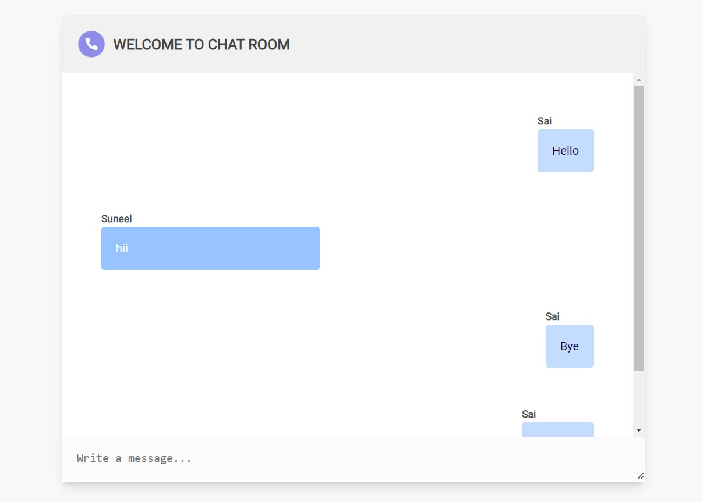

# Welcome to ChatRoom

## Screenshots
# 

A real time chat app built from scratch using SocketIO

## TechStacks / Modules used
- HTML
- CSS 
- JS
- NodeJS
- SocketIO 

<br />

## Requirements
### To be able to run this app locally :
- you need to have Nodejs installed
- you need to have node package manager , npm or yarn( preferable )
<br /><br />

## Installation / Local Setup

### *Running locally ( production server )*
#### `Step 1` - clone the repo
```
bash
$ git clone https://github.com/Saijitheshv07/chatroom/

```

#### `Step 2` - cd in the repo
```
bash
$ cd chatroom
```
#### `Step 3` - install dependencies
```
bash
$ npm install
```
#### `Step 4` - Start the server
```
bash
$ npm start
```
#### `Step 5` - run application
```
bash
$ cd ../chat-room && server.js
```


Live Demo of this chat app can be found <a href="https://cryptic-wave-77343.herokuapp.com/">here. </a>
<br />
